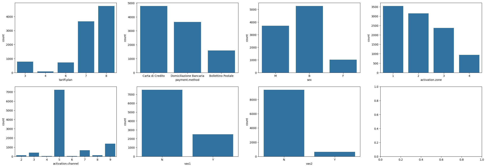
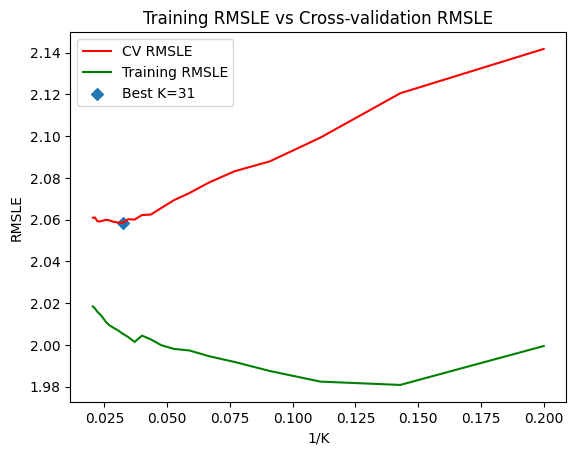

# Phone users Report

# 1. Dataset Analysis

Here is a list of the features in the dataset with their description 

## 1.1 Categorical Features

1. tariff.plan: customer’s tariff plan (1-8)
2. payment.method: payment method (Credit card, Postal Bulletin, Bank, etc. )
3. sex: customer’s sex (Male, Female, Business)
4. activation.zone: geographical area for activation channel (Number)
5. activation.channel: sales channel for activation
6. vas1: the presence of a first value-added service
7. vas2: the presence of a second value-added service

## 1.1.1 Categorical Features Analysis

### Bar Plots for categorical data

- Tariff Plan : Plan 8 and 7 are the most common plans with significant margin with around, then plan 3 and 4 have less users and almost no users for plan 4
- Payment method : Credit Card is the most used payment method
- Sex : Men users are almost 4 times more than female users, with B indicating business with the highest number of users
- Activation Chanel : the 5th activation channel is the most used by a large margin
- Value added service 1 and 2 : Less than 25% of the users use the first VAS, and around 5% only use then second VAS



### Box Plots for Age

- Younger people tend to have plan 7 or 8 and use credit card as a payment method


### Sex

Contrary to our expectation sex is not correlated at all with the response variable and a similar thing is true even looking at the correlation with the other months. It looks like male and female accounts can create huge telephone traffic like a business would.

## 1.2 Quantitative Features

1. Age: age of the person or business representative.  (real-valued)

For each month (9 available months), indicated by the first part of the variable name (q01, q02, …, q9) the following variables are available:

1. q_nn_.out.ch.peak: total monthly number of outgoing calls at times when the tariff is highest
2. q_nn_.out.dur.peak: total monthly duration of outgoing calls at times when the tariff is highest
3. q_nn_.out.val.peak: total monthly value of outgoing calls at times when the tariff is highest
4. q_nn_.out.ch.offpeak: total monthly number of outgoing calls during offpeak hours
5. q_nn_.out.dur.offpeak: total monthly duration of outgoing calls during off-peak hours
6. q_nn_.out.val.offpeak: total monthly value of outgoing calls during off-peak hours
7. q_nn_.in.ch.tot total: monthly number of incoming calls
8. q_nn_.in.dur.tot total: monthly duration of incoming calls
9. q_nn_.ch.sms: total monthly number of SMS sent
10. q_nn_.ch.cc: total monthly number of calls to the Customer Service Centre

## 1.2.1 Numerical Features Analysis

### Peak vs Off-peak


From the correlation matrix of these 2 variables, it is clear that there is almost no correlation between the off-peak and the peak durations however there is a high correlation between one month to the next. This suggests that the outgoing duration for the tenth month can be highly correlated with the ninth month’s features.

# 2. Preprocessing

Steps for Preprocessing:

- **Define Categorical and Numerical Columns**: Identifying which columns are categorical and which are numerical is crucial for applying the appropriate preprocessing techniques.
- **Preprocess Numerical Columns**: Numerical columns often contain a wide range of values and may include outliers or skewed distributions. To handle these, we apply clipping, log transformation, and scaling.
- **Log Transform the Target Variable:** The target variable y is transformed using a logarithmic scale to match the competition's evaluation metric, which is RMSLE. This transformation helps in dealing with skewness and ensuring that the model's predictions are evaluated appropriately.
- **Encode Categorical Features:** One-hot encoding is used because the categorical features don’t contain sequential information so one-hot encoding is appropriate.
- C**oncatenate Numerical and Encoded Categorical Features**: We concatenate the preprocessed numerical columns and the encoded categorical columns to create the final training and test datasets:

```python
train = pd.read_csv('phone_train.csv')
test = pd.read_csv('phone_validation.csv')

# Define Categorical and Numerical Columns
categorical_cols = ['tariff.plan', 'payment.method', 'activation.zone', 'activation.channel', 'vas1', 'vas2', 'sex']
numerical_cols = sorted(list(set(train.columns) - set(categorical_cols) - {'y'} - {'age'}))

# Preprocess Numerical Columns
train_log1p = train.copy()
train_log1p[numerical_cols] = train_log1p[numerical_cols].clip(lower=0)
train_log1p[numerical_cols] = np.log1p(train_log1p[numerical_cols])
scaler = StandardScaler()
train_log1p[numerical_cols] = scaler.fit_transform(train_log1p[numerical_cols])

test_log1p = test.copy()
test_log1p[numerical_cols] = test_log1p[numerical_cols].clip(lower=0)
test_log1p[numerical_cols] = np.log1p(test_log1p[numerical_cols])
test_log1p[numerical_cols] = scaler.transform(test_log1p[numerical_cols])

# Apply Log Transformation to the Target Variable
y_train = np.log1p(train['y'])

# Encode Categorical Features
encoder = OneHotEncoder(sparse_output=False, handle_unknown='ignore')
train_encoded = encoder.fit_transform(train[categorical_cols])
test_encoded = encoder.transform(test[categorical_cols])

# Convert Encoded Features to DataFrames
encoded_cols = encoder.get_feature_names_out(categorical_cols)
train_encoded_df = pd.DataFrame(train_encoded, columns=encoded_cols, index=train.index)
test_encoded_df = pd.DataFrame(test_encoded, columns=encoded_cols, index=test.index)

numerical_cols.append('age')
# Concatenate Numerical and Encoded Categorical Features
train_final = pd.concat([pd.DataFrame(train_log1p[numerical_cols], index=train.index), train_encoded_df], axis=1)
test_final = pd.concat([pd.DataFrame(test_log1p[numerical_cols], index=test.index), test_encoded_df], axis=1)

# Ensure Target Column is Included in the Sample Data
train_final['y'] = np.log1p(train['y'])  # Make sure the target is log-transformed

```

# 3. Model training and testing

The methodology used is splitting the training data into training and validation with an 80-20 split. The validation set is used to tune the parameters of each model, then we compare the models using the [datachallenge.it](http://datachallenge.it) website scores to obtain the best model possible. In our analysis, we analyzed 4 different models:

- Linear regression
- K-nearest neighbors
- CatBoost
- Generalized Additive models

## 3.1. Linear regression

After applying some preprocessing, let’s start with linear regression with all features. We’ll use it in the future as a benchmark. To calculate the RMSE, we use 5-folds cross-validation.

```python
model = LinearRegression()
model.fit(train_final, y_train)
y_pred = model.predict(valid_final)
rmse = np.sqrt(mean_squared_error(y_valid, y_pred))
print(f"RMSE: {rmse}")
```

```python
RMSE: 2.120148633490553
```

## 3.2. K-Nearest Neighbors

Next, we trained a K-Nearest Neighbors model, after applying the preprocessing in 1.2, we first selected the most important features using *Forward stepwise* selection.

```python
regressor = KNeighborsRegressor(n_neighbors=5, p=2, n_jobs=-1)

feature_selector = SequentialFeatureSelector(regressor,
																						 n_features_to_select="auto",
																						 direction="forward",
																						 tol=TOL,
																						 n_jobs=-1,
																						 scoring='neg_root_mean_squared_error')

X_train_reduced = feature_selector.fit_transform(X_train_preprocessed,y_train)

feature_names = feature_selector.get_feature_names_out()

print(f"Featuers selected: {feature_selector.n_features_to_select_}")

print(f"Feature names: {feature_names}")
```

```python
Features selected: 7

Selected features names: ['q03.out.ch.offpeak' 'q05.out.val.offpeak' 'q08.out.val.offpeak'
 'q09.out.ch.peak' 'q09.out.dur.offpeak' 'q09.out.val.offpeak'
 'tariff.plan_3']
```

After we selected the most important features, we decided to do cross-validation to select the best k parameter for the number of neighbors. We choose from a range from 5 to 50 with a step of 2.

```python
# Define and train the model
K_VALS = range(5,50,2)

training_rmse = []
cv_rmse = []
best_score = None
best_k = None

for k in K_VALS:
    knn = KNeighborsRegressor(n_neighbors=k)

    # Cross-validation scores
    cv_scores = cross_val_score(knn, X_train_reduced, y_train, cv=5,
																scoring='neg_mean_squared_error')
    score = np.sqrt(-cv_scores.mean())
    if best_score is None or best_score > score:
      best_score = score
      best_k = k
    cv_rmse.append(score)

    # Training RMSLE
    knn.fit(X_train_reduced, y_train)
    predictions = knn.predict(X_train_reduced)
    training_rmse.append(np.sqrt(mean_squared_error(y_train, predictions)))
```

Then we plot the results:



As we can see from the plot, the best score is obtained with k=31.

```python
Best k value: 31 with a score of 2.0583678519047104
```

## 3.3 Catboost

CatBoost (Categorical Boosting) is an advanced open-source gradient boosting library developed by Yandex. It is specifically designed to handle both numerical and categorical data efficiently, providing robust performance with minimal preprocessing.

**Algorithm Overview:**
CatBoost employs a gradient boosting framework, building an ensemble of decision trees in a sequential manner. The key innovation lies in its handling of categorical features and the method it uses to build these trees:

**Categorical Feature Encoding:**

CatBoost encodes categorical features internally using a technique called target-based statistics, where categorical values are replaced with statistical representations based on the target variable. This maintains the relationships within the data without the need for manual encoding.

**Ordered Boosting:**

Unlike traditional gradient boosting, CatBoost uses ordered boosting, which processes data in a sequential and ordered manner. This helps in reducing overfitting and ensures that the model leverages the temporal or inherent order in the data.

**Symmetric Trees:**

CatBoost constructs symmetric trees, where each level of the tree is balanced. This results in faster training and prediction times and provides more stable performance across different datasets.

### Feature Selection

### LOFO:

Using the LOFO (Leave-One-Feature-Out) library with LightGBM, we identify the most relevant features for our predictive model.

LightGBM is a fast and efficient gradient boosting framework that excels at handling large datasets and categorical features, making it ideal for feature selection. Its accurate feature importance scores help in identifying the most relevant features, which enhances the performance of models like CatBoost that also handle categorical data efficiently.

1. Sample the Data: Extract a small, representative sample from the training dataset.
2. Define Validation Scheme:Use K-Fold cross-validation without shuffling to maintain the order of the data.
3. Use K-Fold cross-validation without shuffling to maintain the order of the data.
Create Dataset for LOFO:
4. Specify the target variable (y) and features, excluding the target from the feature list.
Compute Feature Importance:
5. Use LOFO with LightGBM to calculate the importance of each feature. This evaluates how much each feature contributes to the model's performance.
Plot and Select Important Features:
6. Visualize the mean and standard deviation of feature importance scores.
Select features with positive mean importance scores for further modeling.
Here's the code implementing these steps:

```python
# Extract a Sample of the Data
sample_df = train_final.sample(frac=0.01, random_state=0)
sample_df.sort_values("age", inplace=True)  # Sort by a feature for time split validation

# Define the Validation Scheme
cv = KFold(n_splits=4, shuffle=False, random_state=None)  # Don't shuffle to keep the time split validation

# Define the Binary Target and the Features
dataset = Dataset(df=sample_df, target='y', features=[col for col in train_final.columns if col != 'y'])

# Define the Validation Scheme and Scorer. The default model is LightGBM
lofo_imp = LOFOImportance(dataset, cv=cv, scoring=rmse_scorer)

# Get the Mean and Standard Deviation of the Importances in Pandas Format
importance_df = lofo_imp.get_importance()

# Plot the Means and Standard Deviations of the Importances
plot_importance(importance_df, figsize=(12, 20))

important_features = importance_df[importance_df['importance_mean'] > 0]['feature'].tolist()

```


### Catboost Hyper-parameter Optimization

We used Bayesian optimization to find appropriate hyperparameters for the CatBoost model. Bayesian optimization searches the parameters using a probabilistic model to predict the performance of hyperparameter combinations and iteratively updates its beliefs based on observed results. Then, with the selected hyperparameters, we train the model using the holdout procedure, which involves a train-test split to detect where the model overfits and stop training.

After this procedure, we can re-train the model with the full data using the non-overfitted number of iterations.

```python

# Define Parameter Space for Bayesian Optimization
def catboost_evaluate(depth, learning_rate, l2_leaf_reg, iterations, border_count, bagging_temperature):
        'depth': int(depth),
        'learning_rate': learning_rate,
        'l2_leaf_reg': l2_leaf_reg,
        'iterations': int(iterations),
        'border_count': int(border_count),
        'bagging_temperature': bagging_temperature,
        
        'eval_metric': 'RMSE',
        'loss_function': 'RMSE',
        'random_seed': 32,
        'logging_level': 'Silent',
        'task_type': 'GPU'
    }
    model = CatBoostRegressor(**params)
    # Use a subset of the data for faster optimization
    sample_indices = np.random.choice(train_filtered.index, size=1000, replace=False)
    X_sample = train_filtered.loc[sample_indices]
    y_sample = y_train.loc[sample_indices]
    cv_results = cross_val_score(model, X_sample, y_sample, cv=3, scoring=rmse_scorer).mean()
    return cv_results  # Negative because BayesianOptimization maximizes

# Bayesian Optimization with Parameter Bounds
catboost_bo = BayesianOptimization(
    f=catboost_evaluate,
    pbounds={
        'depth': (5, 15),
        'learning_rate': (0.1, 0.2),
        'l2_leaf_reg': (1, 10),
        'iterations': (500, 1500),
        'border_count': (120, 255),
        'bagging_temperature': (0.0, 1.0),
    
    },
    random_state=42,
    verbose=2
)

catboost_bo.maximize(init_points=5, n_iter=25)

# Get the Best Parameters and Train the Final Model
best_params = catboost_bo.max['params']
best_params['depth'] = int(best_params['depth'])
best_params['iterations'] = int(best_params['iterations'])
best_params['border_count'] = int(best_params['border_count'])

model_final = CatBoostRegressor(
    **best_params,
    eval_metric='RMSE',
    loss_function='RMSE',
    random_seed=32,
    logging_level='Silent',
    task_type = 'GPU'
)

# Split the Filtered Training Data for Final Evaluation
X_train, X_val, y_train_split, y_val_split = train_test_split(train_filtered, y_train, test_size=0.2, random_state=42)

# Create CatBoost Pools
train_pool = Pool(data=X_train, label=y_train_split)
val_pool = Pool(data=X_val, label=y_val_split)

model_final.fit(train_pool, eval_set=val_pool, metric_period=1)

# Predict on the Validation Data
y_val_pred = model_final.predict(val_pool)

# Calculate and Print the RMSE on Validation Data
rmse = np.sqrt(mean_squared_error(np.expm1(y_val_split), np.expm1(y_val_pred)))
print(f'Validation RMSE: {rmse}')

# Predict on the Test Data
y_pred = model_final.predict(test_filtered)

# Reverse the Log Transformation
y_pred = np.maximum(0, np.expm1(y_pred))
```

### Final Training

```python
train_pool = Pool(data=train_filtered, label=y_train)

best_params ={ 'bagging_temperature': 0.11874564727457193,
 'border_count': 167,
 'depth': 12,
 'iterations': 1121,
 'l2_leaf_reg': 12.078818922410875,
 'learning_rate': 0.013573459679120936}
model_final = CatBoostRegressor(
    **best_params,
    eval_metric='RMSE',
    loss_function='RMSE',
    random_seed=32
)

model_final.fit(train_pool, metric_period=10)

# Predict on the Test Data
y_pred = model_final.predict(test_filtered)

# Reverse the Log Transformation
y_pred = np.expm1(y_pred)

np.savetxt('/content/drive/MyDrive/final_predictions_catboost.txt', y_pred, fmt='%f')
```

## 3.4 Generalized additive models

### Feature Selection Process

To optimize our model, we selected the top 30 features that had the highest correlation with the target variable. This was accomplished by computing the absolute correlation values between each feature in the training dataset and the target variable. The features were then sorted in descending order, and the top 30 features with the highest correlation values were retained for further analysis. This step is crucial for reducing dimensionality and focusing on the most relevant features, which can lead to improved model performance and reduced computational complexity.

### Generalized Additive Model (GAM) Setup

For the modeling part, we used a Generalized Additive Model (GAM) with a specified smoothing parameter (lambda, `lam = 0.6`). This model was defined by summing up smooth terms for each of the top 30 features, where each smooth term was given the same lambda value. The lambda value controls the smoothness of the fit, balancing between overfitting and underfitting. A lambda value of 0.6 was chosen after considering the trade-off between model flexibility and generalization.

### Cross-Validation and Model Performance

We performed cross-validation with 5 splits to evaluate the model's performance and ensure its robustness. Each fold was trained and validated separately, and the Root Mean Squared Logarithmic Error (RMSLE) was calculated for each validation set. The average RMSLE across the folds was found to be satisfactory, indicating that the model generalizes well to unseen data.

The cross-validation scores ranged from 0.651 to 0.690, with an overall RMSLE of 0.649 when fitting the model on the entire training set, indicating consistent performance.

```python
# Select most correlated features with the target variable
num_features = 30
correlations = train_final.corrwith(y_train).abs().sort_values(ascending=False)
top_features = correlations.head(num_features).index.tolist()
train_final = train_final[top_features]
test_final = test_final[top_features]

# Print the correlations
pd.set_option('display.max_rows', None)

# Define the custom RMSLE scorer
def rmsle(y_true, y_pred):
    y_pred = np.maximum(0, y_pred)
    return np.sqrt(mean_squared_log_error(y_true, y_pred))

rmsle_scorer = make_scorer(rmsle, greater_is_better=False)

# Variables to adjust the number of samples
num_train_samples = len(train)  # Set the desired number of training samples
num_test_samples = len(test)  # Set the desired number of testing samples

# Reduce the size of training and testing sets
train_final = train_final.iloc[:num_train_samples]
y_train = y_train.iloc[:num_train_samples]
test_final = test_final.iloc[:num_test_samples]

# Define the GAM model
lam = 0.6
gam = LinearGAM(
    s(0, lam=lam) + s(1, lam=lam) + s(2, lam=lam) + s(3, lam=lam) + s(4, lam=lam) +
    s(5, lam=lam) + s(6, lam=lam) + s(7, lam=lam) + s(8, lam=lam) + s(9, lam=lam) +
    s(10, lam=lam) + s(11, lam=lam) + s(12, lam=lam) + s(13, lam=lam) + s(14, lam=lam) +
    s(15, lam=lam) + s(16, lam=lam) + s(17, lam=lam) + s(18, lam=lam) + s(19, lam=lam) +
    s(20, lam=lam) + s(21, lam=lam) + s(22, lam=lam) + s(23, lam=lam) + s(24, lam=lam) +
    s(25, lam=lam) + s(26, lam=lam) + s(27, lam=lam) + s(28, lam=lam) + s(29, lam=lam)
)

# Perform cross-validation
kf = KFold(n_splits=5, shuffle=True, random_state=32)
cv_scores = []

for train_idx, val_idx in kf.split(train_final):
    X_train_cv, X_val_cv = train_final.iloc[train_idx], train_final.iloc[val_idx]
    y_train_cv, y_val_cv = y_train.iloc[train_idx], y_train.iloc[val_idx]
    
    gam.fit(X_train_cv, y_train_cv)
    y_val_pred = gam.predict(X_val_cv)
    
    cv_score = rmsle(y_val_cv, y_val_pred)
    cv_scores.append(cv_score)

print(f'Cross-validation scores: {cv_scores}')

# Fit the model on the entire training data and print the trainnig error
gam.fit(train_final, y_train)
print('RMSLE:', rmsle(y_train, gam.predict(train_final)))

# Predict on the test data and apply inverse transformation
y_pred_log = gam.predict(test_final)
y_pred = np.expm1(y_pred_log)

# Clip the negative values
y_pred = np.maximum(0, y_pred)

# Save the predictions with one column txt
np.savetxt('predictions-gam.txt', y_pred, fmt='%f')
```

Cross-validation scores: [0.6904837576627504, 0.6606906845363224, 0.6671800127055144, 0.6833815494661002, 0.6519603347595503]

RMSLE: 0.6493165313980933

```python
gam.summary()
```


### Top 30 Features

| Index | Feature | Correlation |
| --- | --- | --- |
| 0 | q09.out.val.peak | 0.680995 |
| 1 | q09.out.ch.peak | 0.674583 |
| 2 | q09.out.dur.peak | 0.638821 |
| 3 | q09.in.ch.tot | 0.619703 |
| 4 | q09.in.dur.tot | 0.598227 |
| 5 | q08.out.val.peak | 0.531097 |
| 6 | q08.out.ch.peak | 0.530272 |
| 7 | q07.out.val.peak | 0.520690 |
| 8 | q07.out.ch.peak | 0.510974 |
| 9 | q08.in.ch.tot | 0.510333 |
| 10 | q08.out.dur.peak | 0.503687 |
| 11 | q08.in.dur.tot | 0.488639 |
| 12 | q07.in.ch.tot | 0.482638 |
| 13 | q06.out.val.peak | 0.475111 |
| 14 | q07.out.dur.peak | 0.473595 |
| 15 | q06.out.ch.peak | 0.462455 |
| 16 | q07.in.dur.tot | 0.453586 |
| 17 | q05.out.val.peak | 0.441936 |
| 18 | q06.in.ch.tot | 0.440112 |
| 19 | q05.out.ch.peak | 0.428850 |
| 20 | q06.out.dur.peak | 0.427558 |
| 21 | q04.out.val.peak | 0.419812 |
| 22 | q06.in.dur.tot | 0.414635 |
| 23 | tariff.plan_8 | 0.413470 |
| 24 | q05.in.ch.tot | 0.410962 |
| 25 | q04.out.ch.peak | 0.407353 |
| 26 | q03.out.val.peak | 0.402040 |
| 27 | q09.out.dur.offpeak | 0.401889 |
| 28 | q05.out.dur.peak | 0.401702 |
| 29 | q09.out.ch.offpeak | 0.395579 |

### Summary of GAM Results

The model summary provides detailed insights into the effectiveness of the features:

- **Effective Degrees of Freedom (EDoF):** The EDoF for each smooth term indicates the complexity of the model's fit for that feature. Higher EDoF suggests more flexibility in capturing the feature's relationship with the target.
- **Significance Codes:** The p-values for each smooth term indicate the statistical significance of each feature. Features with low p-values  are highly significant, suggesting a strong relationship with the target variable.

Overall, the model achieved a pseudo R-squared of 0.637, which reflects a reasonable fit considering the complexity of the data. The choice of lambda (0.6) balanced the model's ability to fit the training data while maintaining generalizability.

### Data Challenge RMSE score

```python
2,16715
```

### Functions of Predictors in the GAM

```python
import matplotlib.pyplot as plt

# Define the number of rows and columns for the grid of plots
num_cols = 5
num_terms = len(gam.terms) - 1  # Exclude intercept term
num_rows = (num_terms + num_cols - 1) // num_cols  # Calculate the number of rows needed

fig, axes = plt.subplots(num_rows, num_cols, figsize=(20, num_rows * 4))
axes = axes.flatten()

for i, term in enumerate(gam.terms):
    if term.isintercept:
        continue

    XX = gam.generate_X_grid(term=i)
    pdep, confi = gam.partial_dependence(term=i, X=XX, width=0.95)

    ax = axes[i - 1]
    ax.plot(XX[:, term.feature], pdep)
    ax.plot(XX[:, term.feature], confi, c='r', ls='--')
    ax.set_title(f'Term {i} - {repr(term)}')

# Hide any unused subplots
for j in range(i, len(axes)):
    fig.delaxes(axes[j])

plt.tight_layout()
plt.show()
```


The variability in confidence interval widths highlights differing levels of certainty across predictors. Overall, the GAM successfully captures the complex and varied influences of multiple predictors on the response variable, showcasing its flexibility in modeling non-linear data patterns.

# 4. Results and best model

The best model that we tried is achieved by Catboost model that we optimized parameters and then cut the iterations where model starts to overfit.

If we split the dataset into train and validation set using 

```python
X_train, X_val, y_train_split, y_val_split = train_test_split(train_filtered, y_train, test_size=0.2, random_state=42)

```

Model got the scores for train 

Train Log_RMSE: 1.9074083

Validation Log_RMSE: 1.9833443295115116

After that, we trained the model on whole training set, and submitted our predictions.

```python
train_pool = Pool(data=train_filtered, label=y_train)

best_params ={ 'bagging_temperature': 0.11874564727457193,
 'border_count': 167,
 'depth': 12,
 'iterations': 1121,
 'l2_leaf_reg': 12.078818922410875,
 'learning_rate': 0.013573459679120936}
model_final = CatBoostRegressor(
    **best_params,
    eval_metric='RMSE',
    loss_function='RMSE',
    random_seed=32
)

model_final.fit(train_pool, metric_period=10)

# Predict on the Test Data
y_pred = model_final.predict(test_filtered)

# Reverse the Log Transformation
y_pred = np.expm1(y_pred)

np.savetxt('/content/drive/MyDrive/final_predictions_catboost.txt', y_pred, fmt='%f')
```